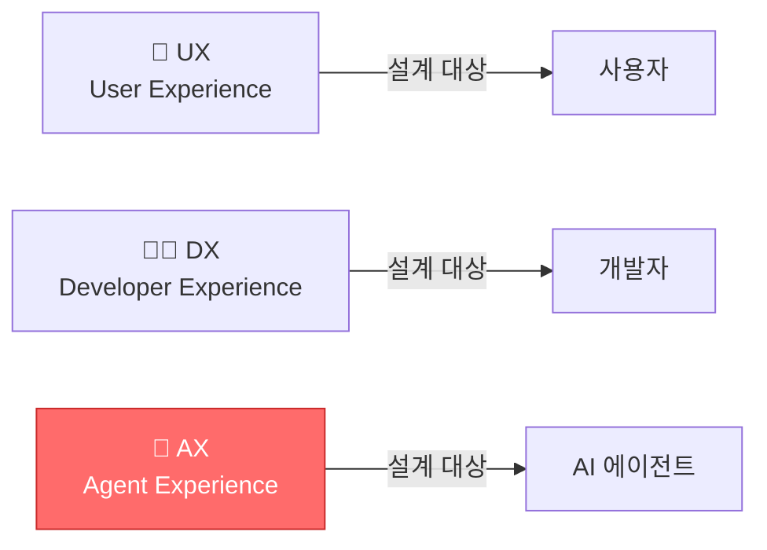
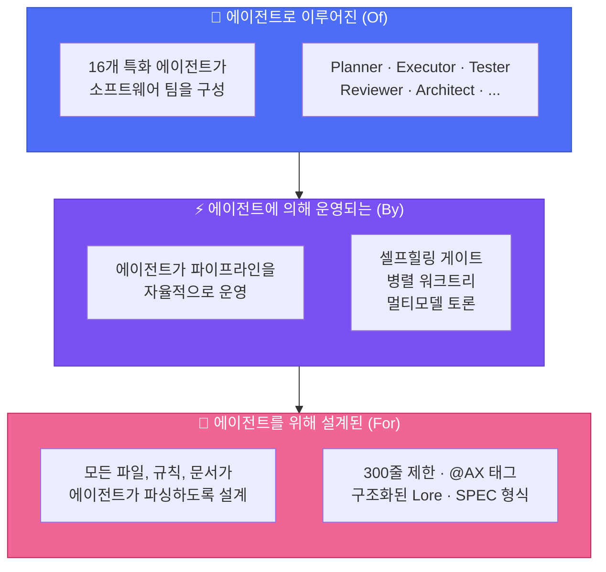
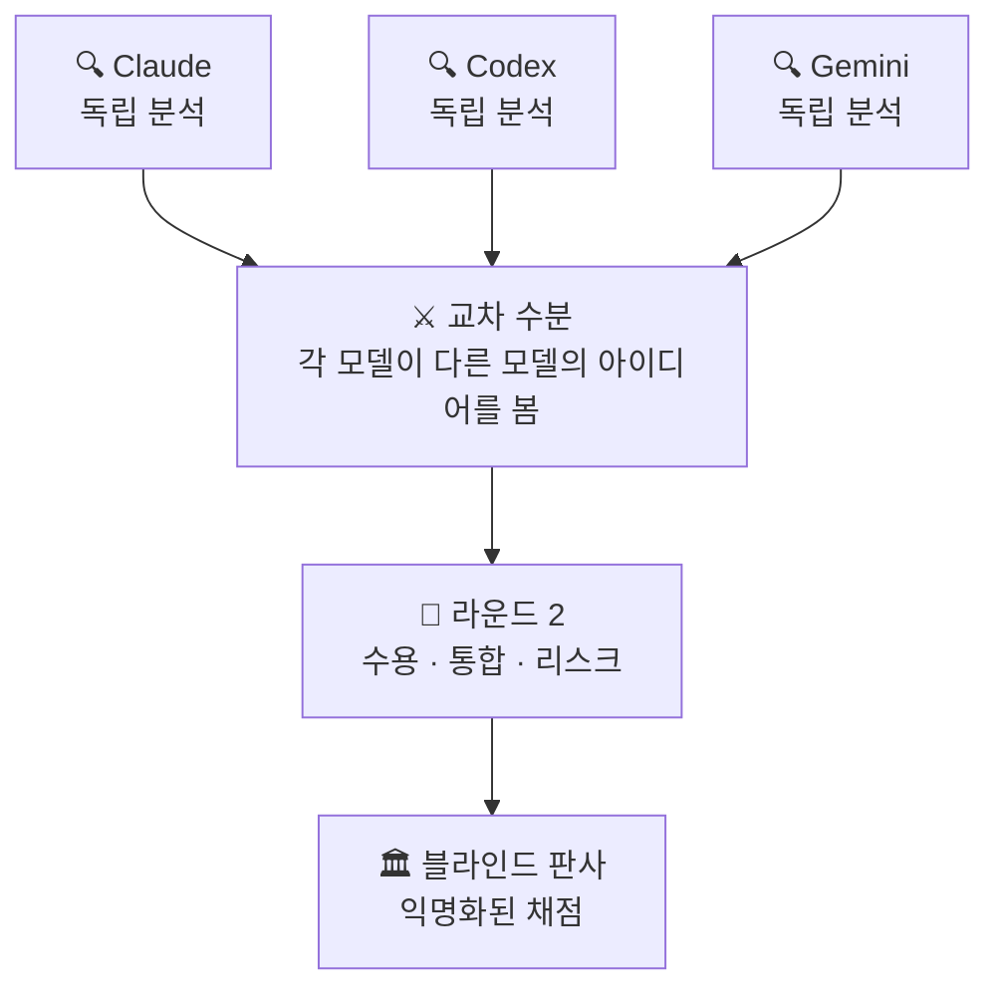

<div align="center">

# 🐙 Autopus-ADK

### 에이전트*로 이루어진*, 에이전트*에 의해 운영되는*, 에이전트*를 위한* 하네스.

AI 코딩 도구(Claude Code, Codex, Gemini CLI, OpenCode)가 진짜 개발팀처럼 일하게 만듭니다 — 기획, 테스트, 코드 리뷰, 보안 감사까지 자동으로.

**16개 에이전트. 40개 스킬. 하나의 설정. 모든 플랫폼.**

[](https://github.com/Insajin/autopus-adk/stargazers)
[](https://opensource.org/licenses/MIT)
[](https://golang.org)
[](#-하나의-설정-네-개-플랫폼)
[](#-16개-전문-에이전트)
[](#-전체-명령어)

**AI 코딩 도구의 채팅창에 아래 명령을 붙여넣으세요 — 에이전트가 실행해서 설치부터 설정까지 알아서 합니다. 터미널에서 직접 실행해도 됩니다.**

```bash
# macOS / Linux
curl -sSfL https://raw.githubusercontent.com/Insajin/autopus-adk/main/install.sh | sh

# Windows (CMD or PowerShell)
powershell -c "irm https://raw.githubusercontent.com/Insajin/autopus-adk/main/install.ps1 | iex"
```

[왜 Autopus인가](#-문제점) · [**핵심 워크플로우**](#-워크플로우) · [주요 기능](#-autopus가-다른-이유) · [파이프라인](#-파이프라인) · [보안](#-보안) · [명령어](#-전체-명령어)

[🇺🇸 English](../README.md)

</div>

---

## 🎬 실제 동작

<p align="center"></p>

```bash
# 3개 AI 모델이 서로 토론하며 브레인스토밍
/auto idea "Google과 GitHub 프로바이더로 OAuth2 인증 추가" --multi --ultrathink

# 한 명령으로 나머지 전부 — 기획, 16개 에이전트 구현, 문서화까지
/auto dev "Google과 GitHub 프로바이더로 OAuth2 인증 추가"
```

단계별 제어를 원한다면:

```bash
/auto plan "Google과 GitHub 프로바이더로 OAuth2 인증 추가" --auto --multi --ultrathink
/auto go SPEC-AUTH-001 --auto --loop --team
/auto sync SPEC-AUTH-001
```

```
🐙 Pipeline ─────────────────────────────────────────────
  ✓ Phase 1:   Planning         planner가 5개 태스크 분해
  ✓ Phase 1.5: Test Scaffold    12개 실패 테스트 생성 (RED)
  ✓ Phase 2:   Implementation   3개 executor가 병렬 워크트리에서 구현
  ✓ Phase 2.5: Annotation       8개 파일에 @AX 태그 적용
  ✓ Phase 3:   Testing          커버리지: 62% → 91%
  ✓ Phase 4:   Review           TRUST 5: APPROVE | 보안: PASS
  ───────────────────────────────────────────────────────
  ✅ 5/5 태스크 │ 91% 커버리지 │ 보안 이슈 0건 │ 4분 32초
```

> 💡 명령 하나로. 테스트, 보안 감사, 문서, 의사결정 이력이 포함된 프로덕션 수준의 코드.

---

## 😤 문제점

AI 코딩 도구를 사용하고 계시죠. 강력합니다. 하지만...

- 🔄 **플랫폼 종속** — Claude에서 Codex로 바꾸려면? 모든 규칙과 프롬프트를 처음부터 다시 작성.
- 🎲 **희망 주도 개발** — "인증 추가해줘" → AI가 코드를 쓰고, 테스트를 건너뛰고, 보안을 무시하고, 문서를 잊음. *아마* 동작할 수도.
- 🧠 **건망증** — 다음 세션에서 AI는 모든 결정을 잊음. "왜 이 패턴을 썼지?" → 침묵.
- 👤 **솔로 에이전트** — 하나의 모델, 하나의 컨텍스트, 한 번의 기회. 다중 파일 리팩토링? 행운을 빕니다.

---

## 🧠 철학: AX — Agent Experience

> **AX**는 "AI Transformation"이 아닙니다. AX는 **Agent Experience** — AI 에이전트가 코드베이스를 인식하고, 탐색하고, 작업하는 방식입니다. UX가 사용자를 위해 설계하고 DX가 개발자를 위해 설계하듯, **AX는 에이전트를 위해 설계합니다.**



대부분의 AI 코딩 도구는 단순한 모델에 기반합니다: **당신이 지시하면, AI가 응답한다.**

Autopus는 다른 질문에서 시작합니다: *프로젝트 문서의 1차 독자가 에이전트라면?*

신입 엔지니어 온보딩을 떠올려 보세요. 빈 에디터를 주고 "인증 시스템 만들어"라고 하지 않죠. 이런 것들을 줍니다:
- 시스템을 이해할 **아키텍처 문서**
- 코드가 기존과 어울리도록 **코딩 컨벤션**
- 같은 실수를 반복하지 않도록 **의사결정 이력**
- 실수가 배포 전에 잡히도록 **리뷰 프로세스**

**AI 에이전트에게도 같은 것이 필요합니다.** 차이점은 매 세션이 첫 출근이라는 것.

Autopus는 **하네스**입니다 — 에이전트가 시니어 엔지니어가 승인할 코드를 생산하기 위해 필요한 맥락, 제약, 워크플로우를 제공하는 구조화된 환경. 희망이 아닌 설계로.

### 에이전트로. 에이전트에 의해. 에이전트를 위해.



| 원칙 | 의미 |
|------|------|
| **에이전트로 이루어진 (Of)** | 16개 특화 에이전트가 실제 엔지니어링 팀을 구성합니다 — 기획자, 구현자, 테스터, 리뷰어, 보안 감사관 등. 하나의 챗봇이 아닌 팀. |
| **에이전트에 의해 운영 (By)** | 에이전트가 파이프라인을 자율적으로 운영합니다 — 셀프힐링 품질 게이트, 병렬 워크트리, 멀티모델 토론. 사람은 목표를 설정하고, 에이전트가 실행합니다. |
| **에이전트를 위해 설계 (For)** | 모든 파일, 규칙, 문서가 에이전트가 파싱하도록 설계됩니다. 산문보다 구조. 그것이 AX입니다. |
| **매 세션이 첫 출근** | 에이전트는 세션 간 모든 맥락을 잃습니다. 하네스가 아키텍처, 의사결정, 컨벤션이라는 조직 기억을 제공합니다. |

> 🐙 **Autopus는 에이전트를 더 똑똑하게 만들지 않습니다. 더 잘 알게 만듭니다. 그것이 AX입니다.**

---

## 🔥 Autopus가 다른 이유

### 📏 에이전트가 읽을 수 있는 코드

대부분의 코드베이스는 AI를 위해 작성되지 않았습니다. 1,200줄짜리 파일은 컨텍스트 윈도우를 압도합니다. 뒤엉킨 책임은 의도를 혼란스럽게 합니다. Autopus는 모든 소스 파일에 **300줄 하드 리밋**을 강제합니다 — 미관이 아닌, **각 파일이 하나의 역할을 하고 한 번에 읽힐 때 에이전트가 더 잘 일하기 때문입니다.**

```
❌ 기존 방식:
   service.go (1,200줄) → 에이전트가 중간에서 맥락을 잃음

✅ Autopus 방식:
   service.go       (180줄)  핸들러 로직
   service_auth.go  (120줄)  인증 미들웨어
   service_repo.go  (150줄)  데이터 접근
   → 모든 파일이 하나의 컨텍스트 윈도우에 들어갑니다. 모든 파일이 하나의 역할을 합니다.
```

이것은 단순히 파일 크기만의 문제가 아닙니다. 전체 하네스가 **설계 단계부터 에이전트가 읽기 쉽게** 만들어져 있습니다:

| 레이어 | 에이전트 친화적 설계 |
|--------|---------------------|
| **규칙** | IMPORTANT 마커가 포함된 구조화된 마크다운 — 에이전트가 파싱합니다 |
| **스킬** | 트리거가 있는 YAML 프론트매터 — 에이전트가 적절한 스킬을 자동 활성화 |
| **문서** | 문단 대신 표, 산문 대신 체크리스트 — 읽히는 게 아니라 파싱됩니다 |
| **코드** | ≤ 300줄, 단일 책임, 관심사별 분리 — 하나의 컨텍스트에 담깁니다 |

> 🐙 **사람이 읽기 좋은 것은 보너스입니다. 에이전트가 읽을 수 있는 것이 요구사항입니다.**

### 🤖 챗봇이 아닌, 팀을 구성하는 AI 에이전트

Autopus는 하나의 AI 어시스턴트가 아닌 — 역할 정의, 품질 게이트, 재시도 로직을 갖춘 **16개 전문 에이전트 소프트웨어 엔지니어링 팀**을 제공합니다.

```
🧠 Planner        →  요구사항을 태스크로 분해
⚡ Executor ×N    →  병렬 워크트리에서 코드 구현
🧪 Tester         →  코드 작성 전에 테스트 먼저 (TDD 강제)
✅ Validator       →  빌드, 린트, vet 검사
🔍 Reviewer       →  TRUST 5 코드 리뷰
🛡️ Security       →  OWASP Top 10 보안 감사
📝 Annotator      →  @AX 태그로 코드 문서화
🏗️ Architect      →  시스템 설계 결정
🔬 Deep Worker    →  장시간 자율 탐색 + 구현
... 외 7개
```

### ⚔️ AI 모델들이 서로 토론한다 (`--multi`)

하나의 모델에는 맹점이 있습니다. **세 모델이 서로의 실수를 잡습니다.**

모든 AI 모델에는 고유한 강점과 편향이 있습니다 — Claude는 꼼꼼하지만 장황하고, Codex는 빠르지만 때로 얕고, Gemini는 완전히 다른 시각을 가져옵니다. `--multi`를 사용하면 단순히 병렬 실행되는 게 아니라 — **서로의 아이디어를 리뷰하고, 도전하고, 발전시킵니다.**

```bash
# 어떤 명령에든 --multi를 추가하면 멀티 모델 지능이 활성화
/auto idea "새 기능" --multi          # 3개 모델 브레인스토밍 → 교차 수분 → ICE 점수
/auto plan "새 기능" --multi          # 3개 모델이 독립적으로 SPEC 리뷰
/auto go SPEC-ID --multi              # 3개 모델이 코드 리뷰 토론
```



**왜 중요한가:**
- Claude가 놓치는 버그를 Codex가 잡고, Codex가 무시하는 엣지 케이스를 Gemini가 지적합니다.
- 하나의 모델이라면 절대 생각하지 못할 아이디어가 교차 수분에서 나옵니다.
- 블라인드 판사가 익명화된 결과를 채점합니다 — 모델 편향 없음.
- 연구에 따르면 멀티 에이전트 토론이 단일 모델보다 높은 품질의 결과를 냅니다.

> **`/auto dev`는 `--multi`를 기본 활성화합니다.** 모든 기획이 멀티 모델 리뷰를 거칩니다. 모든 코드 리뷰가 교차 검증됩니다. 신경 쓸 필요 없습니다.

4가지 전략: **Consensus** (합의 병합) · **Debate** (적대적 리뷰 + 판사) · **Pipeline** (출력 체이닝) · **Fastest** (최초 완료 우선)

### 🔁 자가 치유 파이프라인 (RALF 루프)

품질 게이트는 실패만 하지 않습니다 — **스스로 고치고 재시도합니다.**

```bash
/auto go SPEC-AUTH-001 --auto --loop
```

```
🐙 RALF [Gate 2] ──────────────────
  Iteration: 1/5 │ Issues: 3
  → golangci-lint 경고 수정을 위해 executor 스폰 중...

🐙 RALF [Gate 2] ──────────────────
  Iteration: 2/5 │ Issues: 3 → 0
  Status: PASS ✅
```

**RALF = RED → GREEN → REFACTOR → LOOP** — TDD 원칙을 파이프라인 자체에 적용. 내장 서킷 브레이커가 무한 루프를 방지합니다.

### 🌳 격리된 워크트리에서 병렬 에이전트 실행

여러 executor가 **동시에** 작업합니다 — 각각 자체 git 워크트리에서. 충돌 없음. 손상 없음.

```
Phase 2: Implementation
  ├── ⚡ Executor 1 (worktree/T1) → pkg/auth/provider.go     ✓
  ├── ⚡ Executor 2 (worktree/T2) → pkg/auth/handler.go      ✓
  └── ⚡ Executor 3 (worktree/T3) → pkg/auth/middleware.go    ✓

Phase 2.1: Merge (태스크 ID 순서)
  ✓ T1 병합 → T2 병합 → T3 병합 → 작업 브랜치
```

파일 소유권으로 충돌 방지. GC 억제로 손상 방지. 최대 **5개 동시 워크트리.**

### 📜 Lore: 코드베이스는 절대 잊지 않는다

모든 커밋이 what이 아닌 **why**를 기록합니다. 영원히 조회 가능.

```
feat(auth): OAuth2 프로바이더 추상화 추가

Why: Google + GitHub 지원이 필요하고, 향후 프로바이더 확장 가능해야 함
Decision: 직접 SDK 사용 대신 인터페이스 기반 추상화
Alternatives: 직접 SDK 호출 (거부: 결합도 높음)
Ref: SPEC-AUTH-001

🐙 Autopus <noreply@autopus.co>
```

9개 구조화된 트레일러. `auto lore query "왜 인터페이스?"`로 조회. 90일 지난 결정은 자동 감지.

### 🧪 자율 실험 루프

AI가 자율적으로 반복합니다 — 측정하고, 유지 또는 폐기하고, 반복합니다.

```bash
/auto experiment --metric "go test -bench=BenchmarkProcess" --direction lower --max-iter 5
```

```
🐙 Experiment ───────────────────────
  Iter 1: baseline  │ 1200 ns/op
  Iter 2: optimize  │  850 ns/op  ✓ keep (29% improvement)
  Iter 3: refactor  │  900 ns/op  ✗ discard (regression)
  Iter 4: cache     │  620 ns/op  ✓ keep (27% improvement)
  ─────────────────────────────────────
  Result: 1200 → 620 ns/op (48% improvement)
```