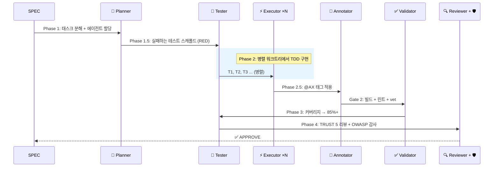
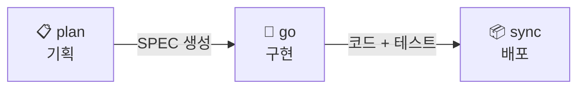

auto update --self && auto update
```

> **언제 업데이트?** 새 버전이 릴리즈되면 `auto update --self`, 그 다음 `auto update`로 프로젝트에 새 규칙/스킬/에이전트를 반영하세요.

### 일반적인 시나리오

<details>
<summary><strong>"버그를 수정하고 싶어요"</strong></summary>

```bash
/auto fix "로그인 페이지에서 500 에러"
```

에이전트가 자동으로:
1. 재현 테스트 작성 (실패 확인)
2. 근본 원인 분석
3. 최소한의 수정 적용
4. 모든 테스트 통과 확인

SPEC 불필요 — 즉시 실행.
</details>

<details>
<summary><strong>"새 기능을 추가하고 싶어요"</strong></summary>

```bash
# 작은 기능 — SPEC만, PRD 생략
/auto plan "GET /healthz 헬스 체크 엔드포인트 추가" --skip-prd

# 큰 기능 — 전체 PRD + SPEC
/auto plan "OAuth2 Google + GitHub 프로바이더 지원"

# 아이디어부터 탐색 — 멀티 프로바이더 브레인스토밍
/auto idea "마이크로서비스로 전환해야 할까?" --multi
```

`/auto idea`는 ICE 채점(Impact, Confidence, Ease)과 멀티 프로바이더 브레인스토밍을 실행하고, BS 파일을 생성하며, `/auto plan`으로 직접 연결할 수 있습니다.
</details>

<details>
<summary><strong>"코드 리뷰를 받고 싶어요"</strong></summary>

```bash
/auto review                    # 현재 변경사항 TRUST 5 리뷰
/auto secure                    # OWASP Top 10 보안 스캔
/auto review --multi            # 멀티 모델 교차 리뷰 (토론 전략)
```
</details>

<details>
<summary><strong>"그냥 자연어로 설명하고 싶어요"</strong></summary>

```bash
/auto 로그인 페이지에 2FA 추가
```

Autopus Triage가 자동으로 요청을 분석합니다:
- 복잡도 평가 (LOW / MEDIUM / HIGH)
- 영향 범위 스캔
- 추천 워크플로우 (fix / plan / idea)

```
🐙 Triage ────────────────────────────
  Request: "로그인 페이지에 2FA 추가"
  Complexity: HIGH → /auto idea --multi (추천)
```

Codex에서는 `.agents/plugins/marketplace.json`에 등록된 로컬 플러그인을 설치한 뒤 `@auto ...`를 쓰거나, 바로 `$auto ...`를 repo skill fallback으로 사용하면 됩니다.
</details>

### 🔄 업데이트

Autopus-ADK는 두 가지 업데이트가 있습니다:

**1. 바이너리 업데이트** — `auto` CLI 자체를 최신 버전으로:

```bash
auto update --self
```

- GitHub Releases에서 최신 버전을 확인하고 SHA256 체크섬 검증 후 교체
- 현재 버전: `auto version`으로 확인

**2. 하네스 업데이트** — 프로젝트의 규칙/스킬/에이전트 파일을 최신으로:

```bash
auto update
```

- `.claude/*`, `.codex/*`, `.gemini/*`, `.opencode/*`, `.agents/skills/*` 등의 하네스 파일을 최신 템플릿으로 갱신
- 사용자가 직접 수정한 내용은 마커(`AUTOPUS:BEGIN`~`AUTOPUS:END`) 바깥이면 보존됨
- 새 플랫폼이 설치되었으면 자동 감지하여 해당 플랫폼 파일도 생성

**언제 업데이트해야 하나요?**

| 명령어 | 시점 |
|--------|------|
| `auto update --self` | 새 기능이 릴리즈되었을 때 (릴리즈 노트 확인) |
| `auto update` | 바이너리 업데이트 후, 새 규칙/스킬/에이전트가 프로젝트에 반영되도록 |

**한 줄로 둘 다:**

```bash
auto update --self && auto update
```

---

## 🤖 파이프라인

### 7단계 멀티 에이전트 파이프라인

모든 `/auto go`가 이 파이프라인을 실행합니다:



### 16개 전문 에이전트

| 에이전트 | 역할 | 실행 시점 |
|---------|------|----------|
| **Planner** | SPEC 분해, 태스크 할당, 복잡도 평가 | Phase 1 |
| **Spec Writer** | spec.md, plan.md, acceptance.md, research.md 생성 | `/auto plan` |
| **Tester** | 테스트 스캐폴드 (RED) + 커버리지 부스트 (GREEN) | Phase 1.5, 3 |
| **Executor** | 병렬 워크트리에서 TDD 구현 | Phase 2 |
| **Annotator** | @AX 태그 라이프사이클 관리 | Phase 2.5 |
| **Validator** | 빌드, vet, 린트, 파일 크기 검사 | Gate 2 |
| **Reviewer** | TRUST 5 코드 리뷰 | Phase 4 |
| **Security Auditor** | OWASP Top 10 취약점 스캔 | Phase 4 |
| **Architect** | 시스템 설계, 아키텍처 결정 | 온디맨드 |
| **Debugger** | 재현 우선 버그 수정 | `/auto fix` |
| **DevOps** | CI/CD, Docker, 인프라 | 온디맨드 |
| **Frontend Specialist** | Playwright E2E + VLM 시각적 회귀 감지 | Phase 3.5 |
| **UX Validator** | 프론트엔드 컴포넌트 시각적 검증 | Phase 3.5 |
| **Perf Engineer** | 벤치마크, pprof, 성능 회귀 감지 | 온디맨드 |
| **Deep Worker** | 장시간 자율 탐색 + 구현 | 온디맨드 |
| **Explorer** | 코드베이스 구조 분석 | `/auto map` |

### 품질 모드

```bash
/auto go SPEC-ID --quality ultra      # 모든 에이전트를 Opus로 — 최고 품질
/auto go SPEC-ID --quality balanced   # 적응형: 태스크 복잡도별 Opus/Sonnet/Haiku
```

| 모드 | Planner | Executor | Validator | 비용 |
|------|---------|----------|-----------|------|
| **Ultra** | Opus | Opus | Opus | $$$ |
| **Balanced** | Opus | 적응형* | Haiku | $ |

\* HIGH 복잡도 → Opus · MEDIUM → Sonnet · LOW → Haiku

### 실행 모드

| 플래그 | 모드 | 설명 |
|--------|------|------|
| *(기본)* | 서브에이전트 파이프라인 | 메인 세션이 Agent() 호출 오케스트레이션 |
| `--team` | Agent Teams | Lead / Builder / Guardian 역할 기반 팀 |
| `--solo` | 단일 세션 | 서브에이전트 없이 직접 TDD |
| `--auto --loop` | 완전 자율 | RALF 자가 치유, 사용자 승인 없음 |
| `--multi` | 멀티 프로바이더 | 여러 모델로 토론/합의 리뷰 |

---

## 📐 워크플로우

### 빠른 경로 — 두 개의 명령

대부분의 기능에는 두 개의 명령만 필요합니다:

```bash
# 1. 브레인스토밍 — 멀티 프로바이더 토론 + 깊은 분석
/auto idea "재시도와 데드 레터 큐를 갖춘 웹훅 전송 추가" --multi --ultrathink

# 2. 빌드 & 배포 — 전체 자율 파이프라인
/auto dev "재시도와 데드 레터 큐를 갖춘 웹훅 전송 추가"
```

`/auto idea`는 멀티 프로바이더 브레인스토밍(Claude x Codex x Gemini 토론)을 딥 순차 사고와 함께 실행하고, ICE로 아이디어를 채점하고, 결과를 저장합니다.

`/auto dev`는 나머지를 처리합니다 — **plan → go → sync**를 한 번에, 모든 파워 플래그가 기본 활성화:

| 단계 | 수행 내용 | 플래그 (자동 적용) |
|------|----------|-------------------|
| **plan** | PRD + SPEC + 멀티 프로바이더 리뷰 | `--auto --multi --ultrathink` |
| **go** | 16개 에이전트 Agent Teams + 자가 치유 | `--auto --loop --team` |
| **sync** | 문서 + 변경 이력 + Lore 커밋 | — |

> 풀 파워가 필요 없다면? `--solo`로 단일 세션 모드, `--no-multi`로 멀티 프로바이더 리뷰 생략, 또는 `plan` / `go` / `sync`를 개별 실행하여 세밀하게 제어하세요.

### 수동 경로 — 세 개의 명령

더 세밀한 제어를 원한다면, 각 단계를 별도로 실행하세요:



### 📋 1단계 · `/auto plan` — 원하는 것을 설명하세요

자연어 설명을 완전한 **SPEC**으로 변환합니다 — 요구사항, 태스크, 수락 기준, 리스크 분석까지.

```bash
/auto plan "재시도와 데드 레터 큐를 갖춘 웹훅 전송 추가"
```

spec-writer 에이전트가 5개 문서를 생성합니다:

```
.autopus/specs/SPEC-HOOK-001/
├── prd.md          # 제품 요구사항 문서
├── spec.md         # EARS 형식 요구사항
├── plan.md         # 태스크 분해 + 에이전트 할당
├── acceptance.md   # Given-When-Then 수락 기준
└── research.md     # 기술 조사 + 리스크
```

옵션: `--multi` 멀티 프로바이더 리뷰 · `--prd-mode minimal` 경량 PRD · `--skip-prd` PRD 건너뛰고 바로 SPEC

### 🚀 2단계 · `/auto go` — 구현하기

SPEC을 **16개 에이전트**에 전달합니다. 기획, 테스트 스캐폴드, 병렬 구현, 검증, 어노테이션, 테스트, 리뷰까지 — 모두 자동으로.

```bash
/auto go SPEC-HOOK-001 --auto --loop
```

```
Phase 1    │ 🧠 Planner         │ SPEC → 태스크 + 에이전트 할당
Phase 1.5  │ 🧪 Tester          │ 실패하는 테스트 스켈레톤 (RED)
Phase 2    │ ⚡ Executor ×N      │ 병렬 워크트리에서 TDD
Phase 2.5  │ 📝 Annotator       │ @AX 문서화 태그
Gate  2    │ ✅ Validator        │ 빌드 + 린트 + vet
Phase 3    │ 🧪 Tester          │ 커버리지 → 85%+
Phase 4    │ 🔍 Reviewer + 🛡️    │ TRUST 5 + OWASP 감사
```

옵션: `--team` Agent Teams · `--solo` 단일 세션 TDD · `--quality ultra` 전체 Opus 실행 · `--multi` 멀티 모델 리뷰

### 📦 3단계 · `/auto sync` — 배포하고 문서화하기

SPEC 상태 업데이트, 프로젝트 문서 재생성, @AX 태그 라이프사이클 관리, 구조화된 Lore 이력으로 커밋.

```bash
/auto sync SPEC-HOOK-001
```

```
╭────────────────────────────────────╮
│ 🐙 파이프라인 완료!                 │
│ SPEC-HOOK-001: 웹훅 전송           │
│ 태스크: 5/5 │ 커버리지: 91%         │
│ 리뷰: APPROVE                      │
╰────────────────────────────────────╯
```

**끝입니다.** 세 개의 명령: 기획 → 구현 → 배포. 모든 결정이 기록됩니다. 모든 테스트가 강제됩니다.

---

## 🎯 TRUST 5 코드 리뷰

모든 리뷰는 5개 차원으로 평가됩니다:

| | 차원 | 검사 항목 |
|---|------|----------|
| **T** | Tested (테스트) | 85%+ 커버리지, 엣지 케이스, `go test -race` |
| **R** | Readable (가독성) | 명확한 네이밍, 단일 책임, ≤ 300 LOC |
| **U** | Unified (일관성) | gofmt, goimports, golangci-lint, 일관된 패턴 |
| **S** | Secured (보안) | OWASP Top 10, 인젝션 없음, 하드코딩된 시크릿 없음 |
| **T** | Trackable (추적성) | 의미 있는 로그, 에러 컨텍스트, SPEC/Lore 참조 |
