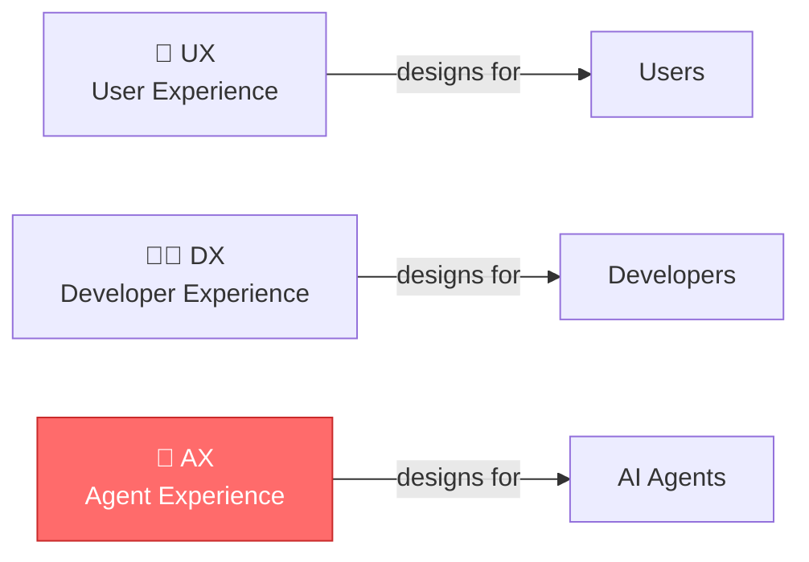
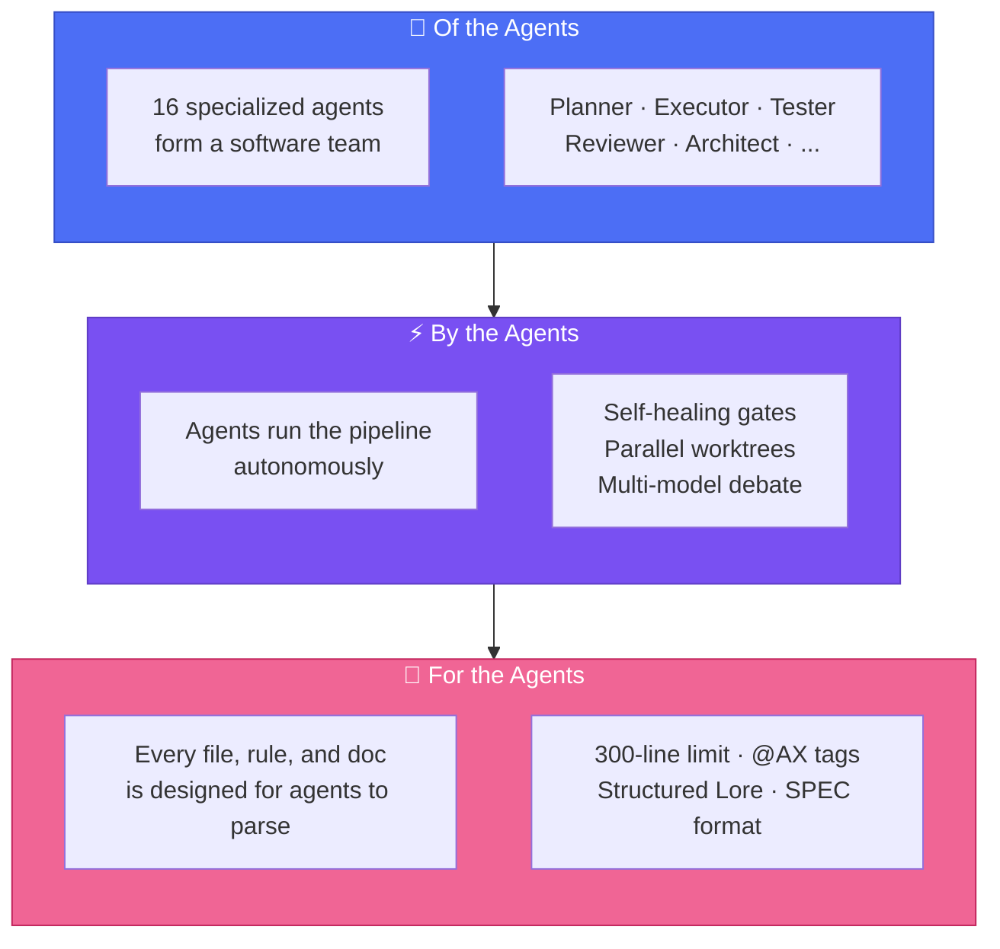
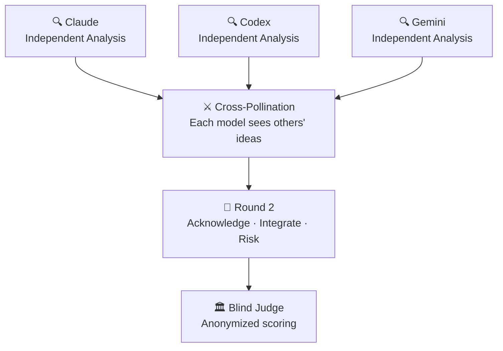
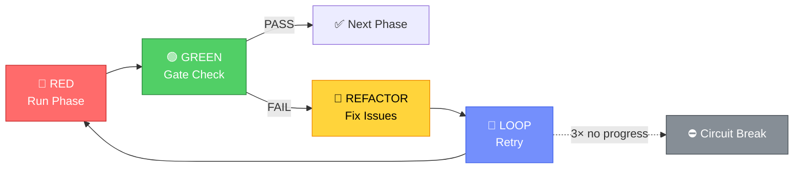

<div align="center">

# 🐙 Autopus-ADK

### A harness *of* the agents, *by* the agents, *for* the agents.

Make your AI coding tools (Claude Code, Codex, Gemini CLI, OpenCode) work like a real engineering team — with planning, testing, code review, and security audits built in.

**16 agents. 40 skills. One config. Every platform.**

[](https://github.com/Insajin/autopus-adk/stargazers)
[](https://opensource.org/licenses/MIT)
[](https://golang.org)
[](#-one-config-four-platforms)
[](#-16-specialized-agents)
[](#-all-commands)

**Paste this command into your AI coding agent's chat (Claude Code, Codex, OpenCode, etc.) — the agent will run it and set up everything automatically. Or run it directly in your terminal.**

```bash
# macOS / Linux
curl -sSfL https://raw.githubusercontent.com/Insajin/autopus-adk/main/install.sh | sh

# Windows (CMD or PowerShell)
powershell -c "irm https://raw.githubusercontent.com/Insajin/autopus-adk/main/install.ps1 | iex"
```

[Why Autopus](#-the-problem) · [**Core Workflow**](#-the-workflow-three-commands-to-ship) · [Features](#-what-makes-autopus-different) · [Pipeline](#-the-pipeline) · [Security](#-security) · [Docs](#-all-commands)

[🇰🇷 한국어](docs/README.ko.md)

</div>

---

## 🎬 See It In Action

<p align="center"></p>

```bash
# Brainstorm with 3 AI models debating each other
/auto idea "Add OAuth2 with Google and GitHub providers" --multi --ultrathink

# One command does the rest — plan, build with 16 agents, ship with docs
/auto dev "Add OAuth2 with Google and GitHub providers"
```

Or if you prefer step-by-step control:

```bash
/auto plan "Add OAuth2 with Google and GitHub providers" --auto --multi --ultrathink
/auto go SPEC-AUTH-001 --auto --loop --team
/auto sync SPEC-AUTH-001
```

```
🐙 Pipeline ─────────────────────────────────────────────
  ✓ Phase 1:   Planning         planner decomposed 5 tasks
  ✓ Phase 1.5: Test Scaffold    12 failing tests created (RED)
  ✓ Phase 2:   Implementation   3 executors in parallel worktrees
  ✓ Phase 2.5: Annotation       @AX tags applied to 8 files
  ✓ Phase 3:   Testing          coverage: 62% → 91%
  ✓ Phase 4:   Review           TRUST 5: APPROVE | Security: PASS
  ───────────────────────────────────────────────────────
  ✅ 5/5 tasks │ 91% coverage │ 0 security issues │ 4m 32s
```

> 💡 One command. Production-ready code with tests, security audit, documentation, and decision history.

---

## ⭐ Star History

<p align="center">
  <a href="https://www.star-history.com/#Insajin/autopus-adk&Date">
    
  </a>
</p>

---

## 😤 The Problem

You're using AI coding tools. They're powerful. But...

- 🔄 **Platform lock-in** — Switch from Claude to Codex? Rewrite all your rules and prompts from scratch.
- 🎲 **Hope-driven development** — "Add auth" → AI writes code, skips tests, ignores security, forgets docs. *Maybe* it works.
- 🧠 **Amnesia** — Next session, the AI forgets every decision. "Why did we use this pattern?" → silence.
- 👤 **Solo agent** — One model, one context, one shot. Multi-file refactoring? Good luck.

---

## 🧠 The Philosophy: AX — Agent Experience

> **AX** is not "AI Transformation." AX is **Agent Experience** — how AI agents perceive, navigate, and operate within your codebase. Just as UX designs for users and DX designs for developers, **AX designs for agents.**



Most AI coding tools are designed around a simple model: **you prompt, it responds.**

Autopus starts from a different question: *What if the agent is the primary audience of your project's documentation?*

Think about onboarding a new engineer. You wouldn't hand them a blank editor and say "build the auth system." You'd give them:
- An architecture overview so they understand the system
- Coding conventions so their code fits in
- Decision history so they don't repeat past mistakes
- A review process so mistakes get caught before shipping

**AI agents need the same things.** The difference is that every session is their first day.

Autopus is a **harness** — a structured environment that gives agents the context, constraints, and workflows they need to produce code that a senior engineer would approve. Not through hope. Through design.

### Of the agents. By the agents. For the agents.



| Principle | What It Means |
|-----------|--------------|
| **Of the Agents** | 16 specialized agents form a real engineering team — planner, executor, tester, reviewer, security auditor, and more. Not one chatbot. A team. |
| **By the Agents** | Agents run the pipeline autonomously — self-healing quality gates, parallel worktrees, multi-model debate. Humans set the goal; agents handle the rest. |
| **For the Agents** | Every file, rule, and document is designed to be parsed by agents, not just read by humans. Structure over prose. That's AX. |
| **Every Session is Day One** | Agents lose all context between sessions. The harness provides institutional memory — architecture, decisions, conventions — so they start informed, not blank. |

> 🐙 **Autopus doesn't make agents smarter. It makes them informed. That's AX.**

---

## 🔥 What Makes Autopus Different

### 📏 Code That Agents Can Actually Read

Most codebases aren't written for AI. A 1,200-line file overwhelms context windows. Tangled responsibilities confuse intent. Autopus enforces a **hard 300-line limit** on every source file — not for aesthetics, but because **agents work better when each file has one job and fits in one read.**

```
❌ Traditional:
   service.go (1,200 lines) → Agent loses context halfway through

✅ Autopus:
   service.go       (180 lines)  Handler logic
   service_auth.go  (120 lines)  Auth middleware
   service_repo.go  (150 lines)  Data access
   → Every file fits in one context window. Every file has one job.
```

This isn't just about file size. The entire harness is **agent-readable by design:**

| Layer | How It's Agent-Friendly |
|-------|------------------------|
| **Rules** | Structured markdown with IMPORTANT markers — agents parse, not skim |
| **Skills** | YAML frontmatter with triggers — agents auto-activate the right skill |
| **Docs** | Tables over paragraphs, checklists over prose — parseable, not readable |
| **Code** | ≤ 300 lines, single responsibility, split by concern — fits in one context |

> 🐙 **Human-readable is a bonus. Agent-readable is the requirement.**

### 🤖 AI Agents That Form a Team, Not a Chatbot

Autopus doesn't give you one AI assistant — it gives you a **software engineering team of 16 specialized agents** with defined roles, quality gates, and retry logic.

```
🧠 Planner        →  Decomposes requirements into tasks
⚡ Executor ×N    →  Implements code in parallel worktrees
🧪 Tester         →  Writes tests BEFORE code (TDD enforced)
✅ Validator       →  Checks build, lint, vet
🔍 Reviewer       →  TRUST 5 code review
🛡️ Security       →  OWASP Top 10 audit
📝 Annotator      →  Documents code with @AX tags
🏗️ Architect      →  System design decisions
🔬 Deep Worker    →  Long-running autonomous exploration + implementation
... and 7 more
```

### ⚔️ AI Models That Debate Each Other (`--multi`)

One model has blind spots. **Three models catch each other's mistakes.**

Every AI model has its own strengths and biases — Claude is thorough but verbose, Codex is fast but sometimes shallow, Gemini brings a different perspective entirely. When you use `--multi`, they don't just work in parallel — they **review, challenge, and build on each other's ideas.**

```bash
# Add --multi to any command for multi-model intelligence
/auto idea "new feature" --multi          # 3 models brainstorm → cross-pollinate → ICE score
/auto plan "new feature" --multi          # 3 models review your SPEC independently
/auto go SPEC-ID --multi                  # 3 models debate your code review
```



**Why this matters:**
- A bug that Claude misses, Codex catches. An edge case Codex ignores, Gemini flags.
- Ideas that one model would never generate emerge from cross-pollination.
- The blind judge scores anonymized results — no model favoritism.
- Research shows multi-agent debate produces higher-quality outputs than any single model alone.

> 💡 **`/auto dev` enables `--multi` by default.** Every plan gets multi-model review. Every code review gets cross-checked. You don't have to think about it.

4 strategies: **Consensus** (merge agreements) · **Debate** (adversarial review + judge) · **Pipeline** (chain outputs) · **Fastest** (first wins)

### 🔁 Self-Healing Pipeline (RALF Loop)

Quality gates don't just fail — they **fix themselves and retry.**



```bash
/auto go SPEC-AUTH-001 --auto --loop
```

```
🐙 RALF [Gate 2] ──────────────────
  Iteration: 1/5 │ Issues: 3
  → spawning executor to fix golangci-lint warnings...

🐙 RALF [Gate 2] ──────────────────
  Iteration: 2/5 │ Issues: 3 → 0
  Status: PASS ✅
```

**RALF = RED → GREEN → REFACTOR → LOOP** — TDD principles applied to the pipeline itself. Built-in circuit breaker prevents infinite loops.

### 🌳 Parallel Agents in Isolated Worktrees

Multiple executors work **simultaneously** — each in its own git worktree. No conflicts. No corruption.

```
Phase 2: Implementation
  ├── ⚡ Executor 1 (worktree/T1) → pkg/auth/provider.go     ✓
  ├── ⚡ Executor 2 (worktree/T2) → pkg/auth/handler.go      ✓
  └── ⚡ Executor 3 (worktree/T3) → pkg/auth/middleware.go    ✓

Phase 2.1: Merge (task-ID order)
  ✓ T1 merged → T2 merged → T3 merged → working branch
```

File ownership prevents conflicts. GC suppression prevents corruption. Up to **5 concurrent worktrees.**

### 📜 Lore: Your Codebase Never Forgets

Every commit captures the **why**, not just the what. Queryable forever.
