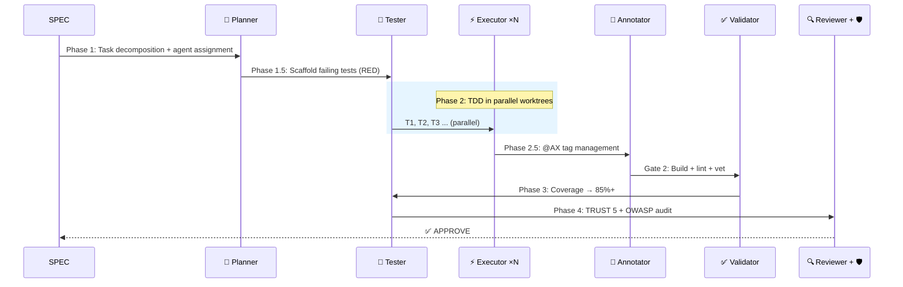
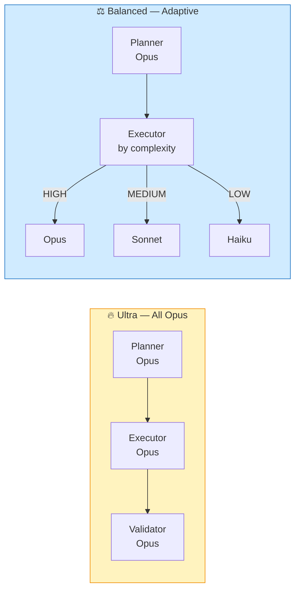

### Step 2 · Initialize the Project

```bash
cd your-project
auto init
```

`auto init` scans your machine for supported installed AI coding CLIs (Claude Code, Codex, Gemini CLI, OpenCode) and generates **native configuration** for each one — rules, skills, agents, and platform-specific settings — all from a single `autopus.yaml`.

```
✓ Detected: claude-code, codex, gemini-cli, opencode
✓ Generated: .claude/rules/, .claude/skills/, .claude/agents/, CLAUDE.md
✓ Generated: .codex/, AGENTS.md
✓ Generated: .gemini/, GEMINI.md
✓ Generated: .opencode/, .agents/skills/, AGENTS.md, opencode.json
✓ Created: autopus.yaml
```

### Step 3 · Set Up Project Context (`/auto setup`)

This is the most important step. **AI agents lose all memory between sessions** — every conversation is their first day on the job. `/auto setup` creates the "onboarding documents" that let agents understand your project instantly.

```bash
/auto setup     # Claude Code, Gemini CLI, OpenCode
@auto setup     # Codex after local plugin install
$auto setup     # Codex fallback before plugin install
```

This analyzes your codebase and generates 5 context documents:

```
ARCHITECTURE.md                    # Domains, layers, dependency map
.autopus/project/product.md       # What this project does, core features
.autopus/project/structure.md     # Directory layout, package roles, entry points
.autopus/project/tech.md          # Tech stack, build system, testing strategy
.autopus/project/scenarios.md     # E2E test scenarios extracted from code
```

> 💡 **Why this matters:** Without these documents, an AI agent looking at your project is like a new hire with no onboarding — they'll guess at architecture, miss conventions, and reinvent patterns that already exist. With `/auto setup`, every agent session starts informed.

### Step 4 · Build Your First Feature

Now you're ready. Describe what you want in plain language:

```bash
# 1. Plan — AI creates a full SPEC (requirements, tasks, acceptance criteria)
/auto plan "Add a health check endpoint at GET /healthz"

# 2. Build — 16 agents handle implementation, testing, and review
/auto go SPEC-HEALTH-001 --auto

# 3. Ship — Sync docs, update SPEC status, commit with decision history
/auto sync SPEC-HEALTH-001
```

```
╭────────────────────────────────────╮
│ 🐙 Pipeline Complete!              │
│ SPEC-HEALTH-001: Health Check      │
│ Tasks: 3/3 │ Coverage: 92%         │
│ Review: APPROVE                    │
╰────────────────────────────────────╯
```

That's it — production-ready code with tests, security audit, and full documentation.

### Quick Reference

| What you want | Command |
|--------------|---------|
| **Brainstorm an idea** | `/auto idea "description" --multi --ultrathink` |
| **Full cycle (recommended)** | `/auto dev "description"` |
| Plan a new feature | `/auto plan "description"` |
| Implement a SPEC | `/auto go SPEC-ID --auto --loop --team` |
| Fix a bug (no SPEC needed) | `/auto fix "description"` |
| Just describe in plain language | `/auto Add 2FA to login page` |
| Post-deploy health check | `/auto canary` |
| Code review | `/auto review` |
| Security audit | `/auto secure` |
| Resume interrupted pipeline | `/auto go SPEC-ID --continue` |
| Update docs after changes | `/auto sync SPEC-ID` |

### Keeping Autopus Up to Date

Autopus has two types of updates:

**1. Binary update** — update the `auto` CLI itself:

```bash
auto update --self
```

Downloads the latest release from GitHub, verifies SHA256 checksum, and atomically replaces the binary. Check your current version with `auto version`.

**2. Harness update** — update rules, skills, and agents in your project:

```bash
auto update
```

Regenerates `.claude/*`, `.codex/*`, `.gemini/*`, `.opencode/*`, `.agents/skills/*`, and other platform-specific files from the latest templates. Your custom edits outside `AUTOPUS:BEGIN`~`AUTOPUS:END` markers are preserved. Newly installed platforms are auto-detected.

**Both at once:**

```bash
auto update --self && auto update
```

> **When to update:** Run `auto update --self` when a new version is released. Then `auto update` to get new rules, skills, and agents into your project.

### Common Scenarios

<details>
<summary><strong>"I want to fix a bug"</strong></summary>

```bash
/auto fix "500 error on login page"
```

The agent automatically:
1. Writes a reproduction test (confirms failure)
2. Analyzes root cause
3. Applies minimal fix
4. Verifies all tests pass

No SPEC needed — runs immediately.
</details>

<details>
<summary><strong>"I want to add a new feature"</strong></summary>

```bash
# Small feature — SPEC only, skip PRD
/auto plan "Add GET /healthz health check endpoint" --skip-prd

# Large feature — full PRD + SPEC
/auto plan "OAuth2 Google + GitHub provider support"

# Exploring an idea first — multi-provider brainstorm
/auto idea "Should we migrate to microservices?" --multi
```

`/auto idea` runs multi-provider brainstorming with ICE scoring (Impact, Confidence, Ease), generates a BS file, and can chain directly into `/auto plan`.
</details>

<details>
<summary><strong>"I want a code review"</strong></summary>

```bash
/auto review                    # TRUST 5 review of current changes
/auto secure                    # OWASP Top 10 security scan
/auto review --multi            # Multi-model cross-review (debate strategy)
```
</details>

<details>
<summary><strong>"I just want to describe what I need in plain language"</strong></summary>

```bash
/auto Add 2FA to the login page
```

Autopus Triage analyzes your request automatically:
- Complexity assessment (LOW / MEDIUM / HIGH)
- Impact scope scan
- Recommended workflow (fix / plan / idea)

```
🐙 Triage ────────────────────────────
  Request: "Add 2FA to the login page"
  Complexity: HIGH → /auto idea --multi (recommended)
```

For Codex, use `@auto ...` after installing the generated local plugin from `.agents/plugins/marketplace.json`, or use `$auto ...` immediately as the repo-skill fallback.
</details>

---

## 🤖 The Pipeline

### 7-Phase Multi-Agent Pipeline

Every `/auto go` runs this:



### 16 Specialized Agents

| Agent | Role | When |
|-------|------|------|
| **Planner** | SPEC decomposition, task assignment, complexity assessment | Phase 1 |
| **Spec Writer** | Generate spec.md, plan.md, acceptance.md, research.md | `/auto plan` |
| **Tester** | Test scaffold (RED) + coverage boost (GREEN) | Phase 1.5, 3 |
| **Executor** | TDD implementation in parallel worktrees | Phase 2 |
| **Annotator** | @AX tag lifecycle management | Phase 2.5 |
| **Validator** | Build, vet, lint, file size checks | Gate 2 |
| **Reviewer** | TRUST 5 code review | Phase 4 |
| **Security Auditor** | OWASP Top 10 vulnerability scan | Phase 4 |
| **Architect** | System design, architecture decisions | on-demand |
| **Debugger** | Reproduction-first bug fixing | `/auto fix` |
| **DevOps** | CI/CD, Docker, infrastructure | on-demand |
| **Frontend Specialist** | Playwright E2E + VLM visual regression | Phase 3.5 |
| **UX Validator** | Frontend component visual validation | Phase 3.5 |
| **Perf Engineer** | Benchmark, pprof, regression detection | on-demand |
| **Deep Worker** | Long-running autonomous exploration + implementation | on-demand |
| **Explorer** | Codebase structure analysis | `/auto map` |

### Quality Modes

```bash
/auto go SPEC-ID --quality ultra      # All agents on Opus — max quality
/auto go SPEC-ID --quality balanced   # Adaptive: Opus/Sonnet/Haiku by task complexity
```



| Mode | Planner | Executor | Validator | Cost |
|------|---------|----------|-----------|------|
| **Ultra** | Opus | Opus | Opus | $$$ |
| **Balanced** | Opus | Adaptive* | Haiku | $ |

\* HIGH complexity → Opus · MEDIUM → Sonnet · LOW → Haiku

### Execution Modes

| Flag | Mode | Description |
|------|------|-------------|
| *(default)* | Subagent pipeline | Main session orchestrates Agent() calls |
| `--team` | Agent Teams | Lead / Builder / Guardian role-based teams |
| `--solo` | Single session | No subagents, direct TDD |
| `--auto --loop` | Full autonomy | RALF self-healing, no human gates |
| `--multi` | Multi-provider | Debate/consensus review with multiple models |

---

## 📐 The Workflow

### ⚡ The Fast Path — Two Commands

For most features, you only need two commands:

```bash
# 1. Brainstorm — multi-provider debate + deep analysis
/auto idea "Add webhook delivery with retry" --multi --ultrathink

# 2. Build & Ship — full autonomous pipeline
/auto dev "Add webhook delivery with retry"
```

`/auto idea` runs multi-provider brainstorming (Claude × Codex × Gemini debate) with deep sequential thinking, scores ideas with ICE, and saves the result.

`/auto dev` does the rest — **plan → go → sync** in one shot with all the power flags on by default:

| Stage | What Happens | Flags (auto-applied) |
|-------|-------------|---------------------|
| **plan** | PRD + SPEC + multi-provider review | `--auto --multi --ultrathink` |
| **go** | 16 agents in Agent Teams + self-healing | `--auto --loop --team` |
| **sync** | Docs + changelog + Lore commit | — |

> 💡 **Don't want the full power?** Use `--solo` for single-session mode, `--no-multi` to skip multi-provider review, or call `plan` / `go` / `sync` individually for fine-grained control.

### 📋 The Manual Path — Three Commands