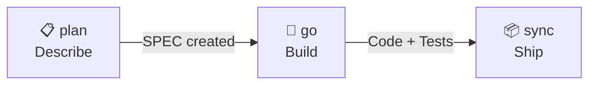

For more control, run each stage separately:



### 📋 Step 1 · `/auto plan` — Describe What You Want

Turn a plain-English description into a full **SPEC** — requirements, tasks, acceptance criteria, and risk analysis.

```bash
/auto plan "Add webhook delivery with retry and dead letter queue"
```

The spec-writer agent produces 5 documents:

```
.autopus/specs/SPEC-HOOK-001/
├── prd.md          # Product Requirements Document
├── spec.md         # EARS-format requirements
├── plan.md         # Task breakdown + agent assignments
├── acceptance.md   # Given-When-Then criteria
└── research.md     # Technical research + risks
```

Options: `--multi` for multi-provider review · `--prd-mode minimal` for lightweight PRDs · `--skip-prd` to go straight to SPEC

### 🚀 Step 2 · `/auto go` — Build It

Feed the SPEC to **16 agents** that plan, scaffold tests, implement in parallel, validate, annotate, test, and review — all automatically.

```bash
/auto go SPEC-HOOK-001 --auto --loop
```

```
Phase 1    │ 🧠 Planner         │ SPEC → tasks + agent assignments
Phase 1.5  │ 🧪 Tester          │ Failing test skeletons (RED)
Phase 2    │ ⚡ Executor ×N      │ TDD in parallel worktrees
Phase 2.5  │ 📝 Annotator       │ @AX documentation tags
Gate  2    │ ✅ Validator        │ Build + lint + vet
Phase 3    │ 🧪 Tester          │ Coverage → 85%+
Phase 4    │ 🔍 Reviewer + 🛡️    │ TRUST 5 + OWASP audit
```

Options: `--team` for Agent Teams · `--solo` for single-session TDD · `--quality ultra` for all-Opus execution · `--multi` for multi-model review

### 📦 Step 3 · `/auto sync` — Ship and Document

Update SPEC status, regenerate project docs, manage @AX tag lifecycle, and commit with structured Lore history.

```bash
/auto sync SPEC-HOOK-001
```

```
╭────────────────────────────────────╮
│ 🐙 Pipeline Complete!              │
│ SPEC-HOOK-001: Webhook Delivery    │
│ Tasks: 5/5 │ Coverage: 91%         │
│ Review: APPROVE                    │
╰────────────────────────────────────╯
```

**That's it.** Three commands: describe → build → ship. Every decision recorded. Every test enforced.

---

## 🎯 TRUST 5 Code Review

Every review scores across 5 dimensions:

| | Dimension | What It Checks |
|---|-----------|----------------|
| **T** | Tested | 85%+ coverage, edge cases, `go test -race` |
| **R** | Readable | Clear naming, single responsibility, ≤ 300 LOC |
| **U** | Unified | gofmt, goimports, golangci-lint, consistent patterns |
| **S** | Secured | OWASP Top 10, no injection, no hardcoded secrets |
| **T** | Trackable | Meaningful logs, error context, SPEC/Lore references |

---

## 📊 Multi-Model Orchestration

| Strategy | How It Works | Best For |
|----------|-------------|----------|
| **🤝 Consensus** | Independent answers merged by key agreement | Planning, code review |
| **⚔️ Debate** | 2-phase adversarial review + judge verdict | Critical decisions, security |
| **🔗 Pipeline** | Provider N's output → Provider N+1's input | Iterative refinement |
| **⚡ Fastest** | First completed response wins | Quick queries |

Providers: **Claude** · **Codex** · **Gemini** · **OpenCode** — with graceful degradation.

**Interactive debate** with real-time pane visualization (cmux/tmux). **Hook-based result collection** for structured JSON output. **WebSearch fallback** when Context7 docs are unavailable.

---

## 📖 All Commands

<details>
<summary><strong>CLI Commands</strong> (28 root commands, 110+ total with subcommands)</summary>

| Command | Description |
|---------|-------------|
| `auto init` | Initialize harness — detect platforms, generate files |
| `auto update` | Update harness (preserves user edits via markers) |
| `auto doctor` | Health diagnostics |
| `auto platform` | Manage platforms (list / add / remove) |
| `auto arch` | Architecture analysis (generate / enforce) |
| `auto spec` | SPEC management (new / validate / review) |
| `auto lore` | Decision tracking (context / commit / validate / stale) |
| `auto orchestra` | Multi-model orchestration (review / plan / secure / brainstorm / job-status / job-wait / job-result) |
| `auto setup` | Project context documents (generate / update / validate / status) |
| `auto status` | SPEC dashboard (done / in-progress / draft) |
| `auto telemetry` | Pipeline telemetry (record / summary / cost / compare) |
| `auto skill` | Skill management (list / info / create) |
| `auto search` | Knowledge search (Exa) |
| `auto docs` | Library documentation lookup (Context7) |
| `auto lsp` | LSP integration (diagnostics / refs / rename / symbols / definition) |
| `auto verify` | Frontend UX verification (Playwright + VLM) |
| `auto check` | Harness rule checks (anti-pattern scanning) |
| `auto hash` | File hashing (xxhash) |
| `auto issue` | Auto issue reporter (report / list / search) |
| `auto experiment` | Autonomous experiment loop (init / metric / record / commit / reset / summary / status) |
| `auto test` | E2E scenario runner (run) |
| `auto react` | Reaction engine (check / apply) |
| `auto agent` | Agent management (create / run) |
| `auto terminal` | Terminal multiplexer management (detect / workspace / split / send / notify) |
| `auto pipeline` | Pipeline state management and monitoring |
| `auto permission` | Permission mode detection (bypass / safe) |
| `auto browse` | Browser automation (cmux browser / agent-browser) |
| `auto canary` | Post-deploy health check (build + E2E + browser) |
| `auto connect` | Provider connection wizard (detect → configure → verify) |
| `auto update --self` | CLI binary self-update (GitHub Releases + SHA256) |

</details>

<details>
<summary><strong>Slash Commands</strong> (inside AI Coding CLI)</summary>

| Command | Description |
|---------|-------------|
| `/auto plan "description"` | Create a SPEC for a new feature |
| `/auto go SPEC-ID` | Implement with full pipeline |
| `/auto go SPEC-ID --auto --loop` | Fully autonomous + self-healing |
| `/auto go SPEC-ID --team` | Agent Teams (Lead/Builder/Guardian) |
| `/auto go SPEC-ID --multi` | Multi-provider orchestration |
| `/auto fix "bug"` | Reproduction-first bug fix |
| `/auto review` | TRUST 5 code review |
| `/auto secure` | OWASP Top 10 security audit |
| `/auto map` | Codebase structure analysis |
| `/auto sync SPEC-ID` | Sync docs after implementation |
| `/auto dev "description"` | Full power: plan(--multi --ultrathink) → go(--team --loop) → sync |
| `/auto setup` | Generate/update project context docs |
| `/auto stale` | Detect stale decisions and patterns |
| `/auto why "question"` | Query decision rationale |
| `/auto experiment` | Autonomous experiment loop (metric-driven iteration) |
| `/auto test` | Run E2E scenarios against your project |
| `/auto go SPEC-ID --continue` | Resume interrupted pipeline from checkpoint |
| `/auto browse` | Browser automation — open, snapshot, click, verify |
| `/auto idea "description"` | Multi-provider brainstorm with ICE scoring |
| `/auto canary` | Post-deploy health check (build + E2E + browser) |

</details>

---

## ⚙️ Configuration

<details>
<summary><strong><code>autopus.yaml</code></strong> — single config for everything</summary>

```yaml
mode: full                    # full or lite
project_name: my-project
platforms:
  - claude-code

architecture:
  auto_generate: true
  enforce: true

lore:
  enabled: true
  required_trailers: [Why, Decision]
  stale_threshold_days: 90

spec:
  review_gate:
    enabled: true
    strategy: debate
    providers: [claude, gemini]
    judge: claude

methodology:
  mode: tdd
  enforce: true

orchestra:
  enabled: true
  default_strategy: consensus
  providers:
    claude:
      binary: claude
    codex:
      binary: codex
    gemini:
      binary: gemini
    opencode:
      binary: opencode
```

</details>

---

## 🏗️ Architecture

```
autopus-adk/
├── cmd/auto/           # Entry point
├── internal/cli/       # 28 Cobra commands (110+ total with subcommands)
├── pkg/
│   ├── adapter/        # 4 platform adapters (Claude, Codex, Gemini, OpenCode)
│   ├── arch/           # Architecture analysis + rule enforcement
│   ├── browse/         # Browser automation backend (cmux/agent-browser routing)
│   ├── config/         # Configuration schema + YAML loading
│   ├── constraint/     # Anti-pattern scanning
│   ├── content/        # Agent/skill/hook/profile generation + skill activator
│   ├── cost/           # Token-based cost estimator
│   ├── detect/         # Platform/framework/permission detection
│   ├── e2e/            # E2E scenario generation, execution, verification
│   ├── experiment/     # Autonomous experiment loop (metric, circuit breaker)
│   ├── issue/          # Auto issue reporter (context collection, sanitization)
│   ├── lore/           # Decision tracking (9-trailer protocol)
│   ├── lsp/            # LSP integration
│   ├── orchestra/      # Multi-model orchestration (4 strategies + brainstorm + interactive debate + hooks)
│   ├── pipeline/       # Pipeline state persistence + checkpoint + team monitor
│   ├── search/         # Knowledge search (Context7/Exa) + hash-based search
│   ├── selfupdate/     # CLI binary self-update (SHA256, atomic replace)
│   ├── setup/          # Project doc generation + validation
│   ├── sigmap/         # AST-based API signature extraction (Go + TypeScript)
│   ├── spec/           # EARS requirement parsing/validation
│   ├── telemetry/      # Pipeline telemetry (JSONL event recording)
│   ├── template/       # Go template rendering
│   ├── terminal/       # Terminal multiplexer adapters (cmux, tmux, plain)
│   └── version/        # Build metadata
├── templates/          # Platform-specific templates
├── content/            # Embedded content (16 agents, 40 skills)
└── configs/            # Default configuration
```

---

## 🔒 Security

### 🛡️ Supply Chain Attack Protection

> *"A popular Python package with tens of millions of monthly downloads was injected with malicious code. A simple `pip install` could steal SSH keys, AWS credentials, and DB passwords — not from the package you installed, but from somewhere deep in its dependency tree."* — [Andrej Karpathy](https://x.com/karpathy)

AI coding environments make this worse: agents auto-install packages, expand dependency trees, and execute code — all without human review. **Autopus builds defense into the pipeline itself.**

#### How Autopus Protects Your Development Workflow

| Layer | Protection | How |
|-------|-----------|-----|
| **Pipeline Gate** | Dependency vulnerability scan at every `/auto go` | Security Auditor agent runs `govulncheck ./...` in Phase 4 |
| **Secret Detection** | Hardcoded credentials caught before commit | `gitleaks detect` scans all changed files |
| **Dependency Audit** | Known CVE detection in dependency tree | `go list -m -json all \| nancy sleuth` for Go projects |
| **Lock File Integrity** | Checksum-verified dependencies | Go's `go.sum` ensures reproducible, tamper-proof builds |
| **OWASP Top 10** | Injection, auth bypass, SSRF — all checked | Security Auditor covers A01–A10 systematically |
| **AI Agent Guardrails** | Agents can't blindly install packages | Harness rules constrain agent actions; security gate blocks deploy on FAIL |

#### For Non-Go Projects

The same principles apply when Autopus manages Python, Node.js, or other ecosystems:

```yaml
# autopus.yaml — configure per-ecosystem security scans
security:
  scanners:
    go: "govulncheck ./..."
    python: "pip-audit && safety check"
    node: "npm audit --audit-level=high"
```

**Best practices enforced by the harness:**
- **Version pinning** — Lock all dependencies to exact versions (`go.sum`, `package-lock.json`, `requirements.txt`)
- **Minimal dependencies** — The 300-line file limit and single-responsibility rule naturally reduce unnecessary imports
- **Isolation** — Parallel executors run in isolated git worktrees; no cross-contamination between tasks
- **No blind installs** — Security Auditor agent flags unknown or unvetted packages before they enter the codebase

### Binary Distribution Safety

Every binary release includes **SHA256 checksums** (`checksums.txt`), verified automatically during installation. No blind `curl | sh` — every download is integrity-checked before execution.

**Recommended: Inspect before you install**